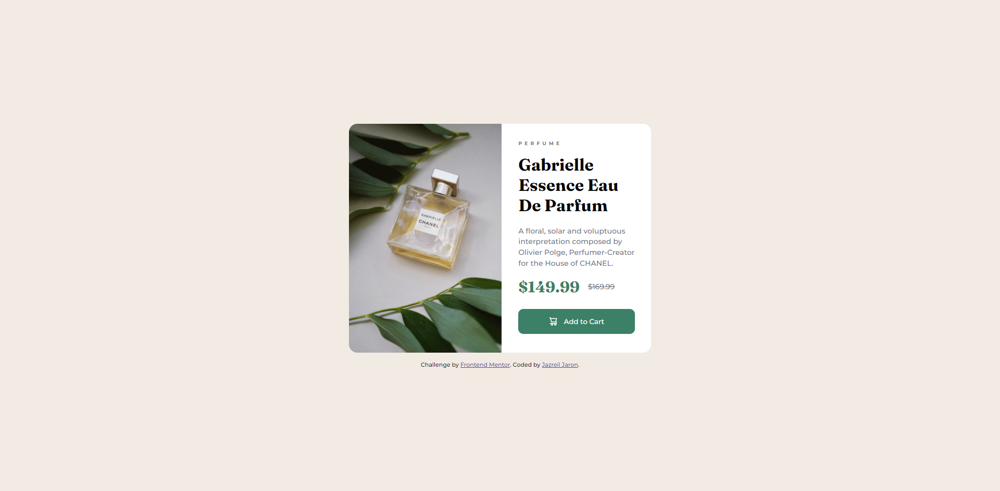

# Frontend Mentor - Product preview card component solution

This is a solution to the [Product preview card component challenge on Frontend Mentor](https://www.frontendmentor.io/challenges/product-preview-card-component-GO7UmttRfa). Frontend Mentor challenges help you improve your coding skills by building realistic projects. 

## Table of contents

- [Frontend Mentor - Product preview card component solution](#frontend-mentor---product-preview-card-component-solution)
  - [Table of contents](#table-of-contents)
  - [Overview](#overview)
    - [The challenge](#the-challenge)
    - [Screenshot](#screenshot)
      - [Desktop View](#desktop-view)
      - [Mobile View](#mobile-view)
      - [Links](#links)
  - [My process](#my-process)
    - [Built with](#built-with)
    - [What I learned](#what-i-learned)
  - [Author](#author)

## Overview

### The challenge

Users should be able to:

- View the optimal layout depending on their device's screen size
- See hover and focus states for interactive elements

### Screenshot

#### Desktop View

---
#### Mobile View

#### Links

- Solution URL: [https://github.com/Atlas-jjs/product-preview-card]
- Live Site URL: [https://atlas-jjs.github.io/product-preview-card/]
## My process

### Built with

- Semantic HTML5 markup
- CSS custom properties
- Flexbox
- CSS Grid

### What I learned

- Workflow was smoother thanks to the two other newbie exercises.
- Learning how to make it responsive in mobile.

## Author

- Website - [Jazreil Jaron](https://atlas-jjs.github.io/faq-accordion-desktop/)
- Frontend Mentor - [@Atlas-jjs](https://www.frontendmentor.io/profile/Atlas-jjs)
